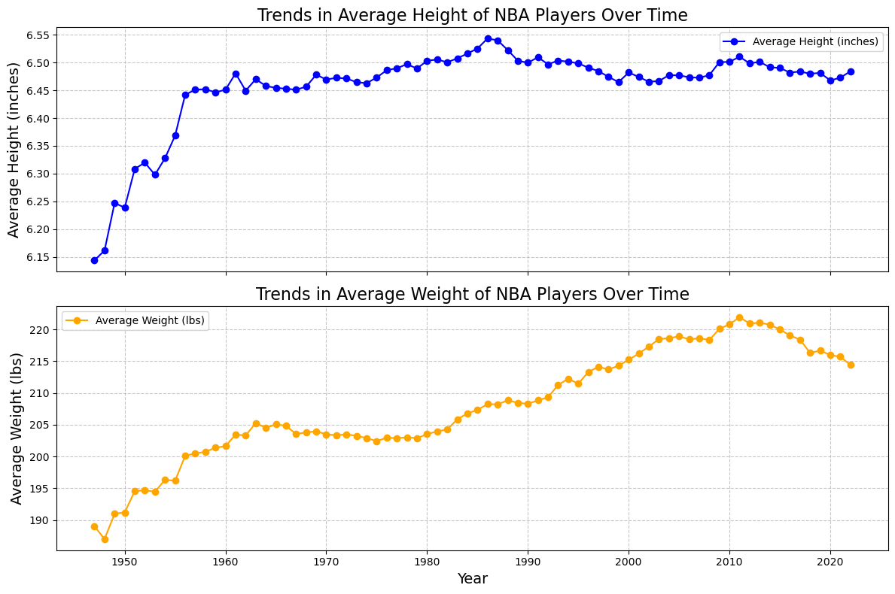

# Web scraping and Statistical Tests
In Repo, we are going to get familiar with Python tools used for web scraping and data crawling. Next, we will thoroughly investigate the tools and methods frequently used in statistics:

- Scrape web for data and save as .db file
- preprocess and process data for statistical tests
- performing statistical tests:
  - **Hypotheses**:
     - **Null Hypothesis (H₀):** There is no difference in height between players in the top 50 and those not in the top 50.
     - **Alternative Hypothesis (H₁):** There is a difference in height between players in the top 50 and those not in the top 50.

  - **Results**:
     - **T-Statistic**: `-2.266`
     - **P-Value**: `0.0271`
     - **Mean Height of Top 50 Players**: `6.44`
     - **Mean Height of Non-Top 50 Players**: `6.54`

  - **Interpretation**:
     - The p-value (\(p = 0.0271\)) is **less than 0.05**, indicating that the difference in height between the two groups is statistically significant.
     - The negative t-statistic indicates that players in the top 50 are, on average, **shorter** than players not in the top 50.

  - **Summary**:
     - While the difference in height is statistically significant, the actual difference in mean height is relatively small (approximately `0.10` units). This suggests that height may not be a major factor in determining whether a player is in the top 50.
- Visualize trends in data

    

